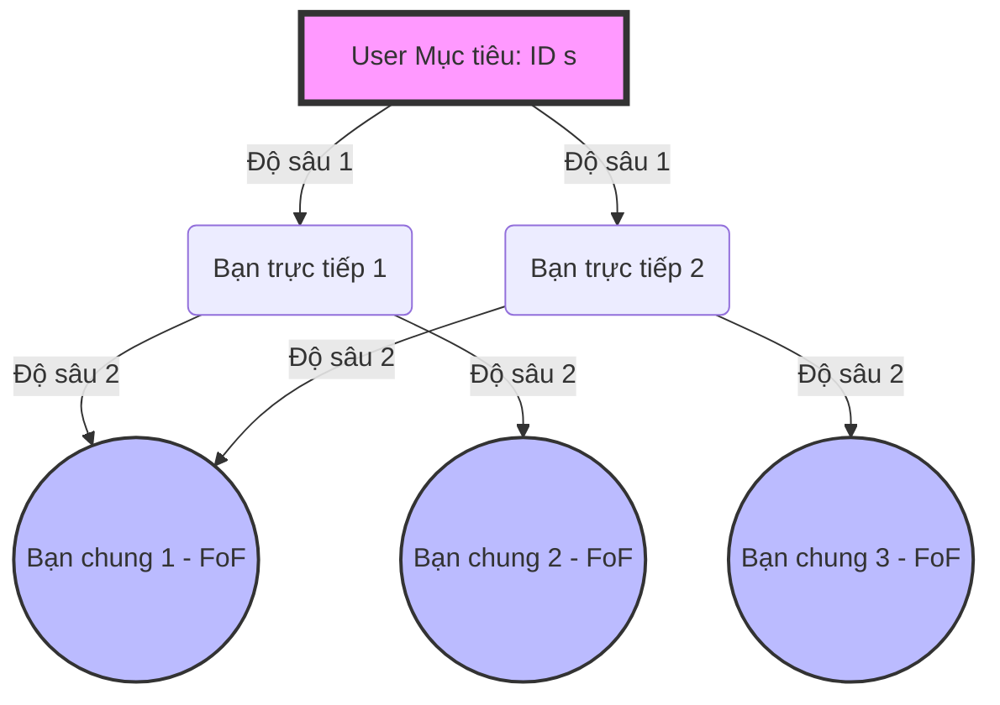

# Mô Phỏng Mạng Xã Hội: Xác Định "Người Quen Của Người Quen" (BFS) và Gợi Ý Kết Bạn

[](https://en.cppreference.com/w/cpp/17)
[](#hướng-dẫn-chạy-dự-án)
[](#các-thuật-toán-cốt-lõi)
[](#hướng-dẫn-sử-dụng-các-tính-năng)

Dự án này là một hệ thống giả lập mạng xã hội có quy mô trung bình (hơn 10.000 người dùng và 110.000 mối quan hệ bạn bè). Hệ thống được phát triển hoàn toàn bằng ngôn ngữ **C++17** theo hướng tối ưu hóa hiệu năng cực cao. Điểm nổi bật nhất của dự án là **không sử dụng bất kỳ cấu trúc dữ liệu dựng sẵn nào của thư viện chuẩn C++ (STL)** như `std::vector`, `std::unordered_map`, `std::unordered_set`, `std::queue`, hay `std::sort`. Thay vào đó, toàn bộ cấu trúc dữ liệu và giải thuật cốt lõi đều được **tự xây dựng thủ công từ đầu (from scratch)** để mang lại quyền kiểm soát bộ nhớ tuyệt đối và hiệu năng tối ưu nhất.

---

## 📌 Mục Lục
1. [Giới Thiệu Chung](#giới-thiệu-chung)
2. [Cấu Trúc Dữ Liệu Tự Thiết Kế (Custom CSD&GT)](#cấu-trúc-dữ-liệu-tự-thiết-kế-custom-csdgt)
3. [Các Thuật Toán Cốt Lõi](#các-thuật-toán-cốt-lõi)
4. [Kiến Trúc Mã Nguồn & Sơ Đồ Tổ Chức](#kiến-trúc-mã-nguồn--sơ-đồ-tổ-chức)
5. [Hướng Dẫn Cài Đặt & Chạy Dự Án](#hướng-dẫn-cài-đặt--chạy-dự-án)
6. [Kịch Bản Thử Nghiệm Đặc Biệt (17 Edge-case Test Cases)](#kịch-bản-thử-nghiệm-đặc-biệt-17-edge-case-test-cases)
7. [Hướng Dẫn Sử Dụng Các Tính Năng](#hướng-dẫn-sử-dụng-các-tính-năng)
8. [Đánh Giá Hiệu Năng Thực Tế (Benchmark)](#đánh-giá-hiệu-năng-thực-tế-benchmark)

---

## 1. Giới Thiệu Chung
Trong các mạng xã hội hiện đại như Facebook, LinkedIn hay Twitter, tính năng gợi ý kết bạn ("People You May Know") đóng vai trò then chốt trong việc giữ chân người dùng và mở rộng vòng kết nối xã hội.

Dự án này mô phỏng lại các liên kết phi hướng này thông qua một đồ thị không hướng $G = (V, E)$, với:
* **Tập đỉnh $V$**: Đại diện cho những người dùng trong hệ thống (mỗi người dùng gồm ID số nguyên độc nhất và Tên đầy đủ).
* **Tập cạnh $E$**: Biểu diễn quan hệ bạn bè trực tiếp giữa hai người dùng bất kỳ.

Hệ thống sử dụng thuật toán **BFS (Breadth-First Search)** để quét cấu trúc đồ thị và xác định các mối quan hệ gián tiếp có khoảng cách địa lý bằng 2 ("bạn của bạn" hay "người quen của người quen"). Từ đó, hệ thống thực hiện phân tích số lượng bạn chung, sắp xếp và gợi ý các ứng viên kết bạn tiềm năng nhất cho người dùng mục tiêu.

---

## 2. Cấu Trúc Dữ Liệu Tự Thiết Xây Dựng (Custom CSD&GT)
Để đạt được hiệu năng tối đa và loại bỏ overhead từ thư viện STL, dự án tự hiện thực hóa các cấu trúc dữ liệu động dưới dạng Template trong C++:

### 🔹 1. `HashMap<K, V>` (Bảng băm tùy biến)
* **Nguyên lý hoạt động**: Sử dụng bảng băm giải quyết đụng độ bằng phương pháp **Chaining (nối chuỗi đơn)** thông qua các `HashNode`.
* **Tự động Rehash**: Khi hệ số tải (Load Factor) vượt ngưỡng $0.75$, bảng băm sẽ tự động nhân đôi kích thước bucket ($2 \times N$) và phân phối lại toàn bộ các phần tử hiện có nhằm giữ độ phức tạp tìm kiếm/chèn đạt trạng thái tối ưu $O(1)$ trung bình.
* **Bộ lặp duyệt**: Cung cấp hàm `forEach` nhận lambda để duyệt qua mọi cặp `(key, value)` cực nhanh mà không phát sinh bộ nhớ đệm phụ.

### 🔹 2. `HashSet<T>` (Tập hợp không lặp)
* **Nguyên lý hoạt động**: Hiện thực hóa dưới dạng một lớp bọc (wrapper) bên ngoài `HashMap<T, bool>`.
* **Ưu điểm**: Đảm bảo các thao tác thêm, xóa, kiểm tra phần tử tồn tại (`contains`) đều chạy trong thời gian trung bình $O(1)$. Thích hợp cho danh sách bạn bè trực tiếp của người dùng.

### 🔹 3. `Vector<T>` (Mảng động tự co giãn)
* **Nguyên lý hoạt động**: Mô phỏng hoạt động của `std::vector` với cơ chế phân bổ bộ nhớ động liên tục.
* **Chiến lược tăng trưởng**: Khi mảng đầy, sức chứa (`capacity`) sẽ tự động nhân đôi (geometric expansion factor = 2) để đảm bảo chi phí khấu hao (amortized cost) cho mỗi lần chèn cuối `push_back` là $O(1)$.
* **Quản lý tài nguyên**: Hiện thực đầy đủ Copy Constructor, Copy Assignment, Move Constructor và Move Assignment theo quy tắc chuẩn để tránh rò rỉ bộ nhớ.

### 🔹 4. `Queue<T>` (Hàng đợi FIFO)
* **Nguyên lý hoạt động**: Hiện thực dưới dạng **Danh sách liên kết đơn** với con trỏ `head` và `tail`.
* **Đặc tính**: Hỗ trợ các thao tác `push` (chèn cuối) và `pop` (xóa đầu) trong thời gian tuyệt đối $O(1)$ mà không cần di chuyển các phần tử vật lý như mảng tĩnh, là cấu trúc nền tảng cho BFS.

### 🔹 5. `CustomSort.h` (Thuật toán Sắp xếp Hoạt Họa)
* **Thuật toán chính**: Sử dụng **QuickSort phân hoạch Hoare (Hoare Partition)** kết hợp các kỹ thuật tối ưu hóa kinh điển:
  * **Median-of-Three**: Chọn phần tử chốt (pivot) bằng trung vị của 3 phần tử (đầu, giữa, cuối) giúp tránh rơi vào trường hợp tệ nhất $O(N^2)$ khi dữ liệu đã được sắp xếp sẵn.
  * **Insertion Sort Cutoff**: Khi kích thước mảng con cần sắp xếp nhỏ hơn $10$ phần tử, thuật toán tự động chuyển sang sắp xếp chèn (Insertion Sort) nhằm giảm thiểu chi phí gọi đệ quy sâu, tận dụng tối đa tính cục bộ của bộ nhớ đệm (cache locality).
  * **Đệ quy tối ưu đuôi (Tail Call Optimization)**: Tiết kiệm không gian Stack xuống còn $O(\log N)$ trong mọi kịch bản.

---

## 3. Các Thuật Toán Cốt Lõi

### 🏃‍♂️ 1. Thuật toán BFS Xác định Bạn của Bạn (Do thám độ sâu 2)
Để xác định các đỉnh có khoảng cách ngắn nhất đến đỉnh nguồn $s$ chính xác bằng $2$:
1. Khởi tạo một hàng đợi `Queue<BFSNode>` chứa cặp giá trị `{userID, depth}`. Đưa `{s, 0}` vào hàng đợi.
2. Khởi tạo `HashSet<int> visited` để theo dõi các nút đã duyệt, tránh lặp vòng. Đánh dấu `s` đã duyệt.
3. Trong khi hàng đợi không rỗng:
   * Lấy đỉnh đầu hàng đợi ra ký hiệu là `curr` với độ sâu tương ứng là `curr.depth`.
   * Nếu `curr.depth == 2`:
     * Đưa `curr.userID` vào tập kết quả `friendsOfFriends`.
     * Tiếp tục vòng lặp (không phát triển thêm vì chúng ta chỉ quan tâm độ sâu tối đa là 2).
   * Nếu `curr.depth < 2`:
     * Duyệt qua danh sách bạn bè trực tiếp của `curr.userID` trong đồ thị (lấy từ Adjacency List).
     * Với mỗi người bạn `neighbor`, nếu chưa có trong `visited`:
       * Đánh dấu `visited.insert(neighbor)`.
       * Đưa `{neighbor, curr.depth + 1}` vào hàng đợi.
4. Trả về tập hợp `friendsOfFriends` chứa toàn bộ những người dùng có đường đi ngắn nhất đến $s$ bằng đúng 2 bước nhảy.



### 🤝 2. Giải thuật Gợi Ý Kết Bạn (Friend Suggestion)
Thuật toán gợi ý dựa trên nguyên tắc: **Những người có nhiều bạn chung nhất với bạn nhưng chưa phải là bạn trực tiếp của bạn thì có khả năng cao nhất bạn sẽ muốn kết bạn với họ.**

**Các bước thực hiện:**
1. Lấy danh sách bạn bè trực tiếp của đỉnh nguồn $U$, ký hiệu là tập hợp $F_U = \text{adjList}[U]$.
2. Khởi tạo một bảng băm đếm tần suất chung: `HashMap<int, Vector<int>> mutualMap` với Key là ID của người lạ và Value là danh sách ID những bạn chung làm cầu nối.
3. Duyệt qua từng người bạn trực tiếp $f \in F_U$:
   * Với mỗi $f$, duyệt qua danh sách bạn bè của họ $fof \in \text{adjList}[f]$:
     * Nếu $fof \neq U$ và $fof \notin F_U$ (nghĩa là không phải chính mình và chưa kết bạn trực tiếp):
       * Thêm $f$ vào danh sách bạn chung của $fof$: `mutualMap[fof].push_back(f)`.
4. Chuyển đổi dữ liệu từ bảng băm `mutualMap` sang một `Vector<FriendSuggestion>` chứa thông tin ứng viên, số lượng bạn chung, và danh sách các bạn chung cụ thể.
5. Sử dụng cấu trúc sắp xếp QuickSort tùy biến để sắp xếp danh sách giảm dần theo số bạn chung (`mutualConnectionsCount`).
6. Cắt ngắn kết quả để chỉ lấy ra tối đa `maxSuggestions` người dùng đứng đầu danh sách và trả về.

---

## 4. Kiến Trúc Mã Nguồn & Sơ Đồ Tổ Chức
Thư mục dự án được cấu trúc rõ ràng, tách biệt giữa mã nguồn C++, dữ liệu mẫu và các công cụ bổ trợ bằng Python:

```text
social_media/
├── src/                          # Mã nguồn C++ chính của dự án
│   ├── CustomVector.h            # Cấu trúc Mảng động tự co giãn
│   ├── CustomHashMap.h           # Cấu trúc Bảng băm (độ phức tạp O(1))
│   ├── CustomHashSet.h           # Cấu trúc Tập hợp không lặp
│   ├── CustomQueue.h             # Cấu trúc Hàng đợi liên kết đơn
│   ├── CustomSort.h              # QuickSort (Hoare Partition + Median-of-Three)
│   ├── SocialMedia.h             # Lớp quản lý đồ thị mạng xã hội
│   ├── SocialMedia.cpp           # Hiện thực hóa các phương thức của SocialMedia
│   └── main.cpp                  # Chương trình tương tác dòng lệnh (CLI CLI)
├── scripts/                      # Thư mục chứa tập lệnh sinh dữ liệu & Testcases
│   ├── generate_dataset.py       # Script Python tạo đồ thị ngẫu nhiên quy mô lớn
│   ├── users.csv                 # Tệp dữ liệu người dùng được sinh ra (10,500+ dòng)
│   ├── edges.txt                 # Tệp chứa các cạnh liên kết quan hệ (110,000+ dòng)
│   └── testcases/                # Chứa 17 bộ kịch bản kiểm thử biên đặc biệt
│       ├── tc01_isolated_user/
│       ├── tc02_single_friend/
│       └── ...
├── Makefile                      # Tệp cấu hình biên dịch tự động đa nền tảng
├── README.md                     # Tài liệu hướng dẫn sử dụng này
└── build/                        # Thư mục tạm chứa các file đối tượng .o sau khi biên dịch
```

---

## 5. Hướng Dẫn Cài Đặt & Chạy Dự Án

### 📋 Yêu cầu Hệ thống
* **Trình biên dịch C++**: Hỗ trợ chuẩn C++17 trở lên (khuyên dùng `g++` bản 9.0+ hoặc `clang`).
* **Python**: Phiên bản Python 3.x (để chạy script sinh dữ liệu nếu muốn tự tạo lại).
* **Công cụ build**: `make` (để đơn giản hóa quá trình biên dịch).

### 🛠️ Bước 1: Biên dịch Dự án
Mở terminal tại thư mục gốc của dự án và chạy lệnh sau để tự động biên dịch:

```bash
make clean && make
```
*Lệnh này sẽ tự động tạo thư mục `build/`, biên dịch tất cả các tệp `.cpp` thành file đối tượng `.o`, rồi liên kết chúng lại để tạo ra tệp thực thi duy nhất mang tên `SocialMedia`.*

### 📊 Bước 2: Sinh dữ liệu mẫu (Quy mô Lớn)
Hệ thống đã chuẩn bị sẵn một kịch bản sinh dữ liệu vô cùng thực tế qua script Python. Đồ thị sinh ra được mô phỏng theo mạng xã hội thực tế với các thuộc tính:
* **Scale-free distribution** (Phân phối không tỷ lệ): Sử dụng cơ chế Preferential Attachment (liên kết ưu tiên) để tạo ra các "influencer" (Hub) có lượng tương tác cực lớn, trong khi đa số người dùng thường chỉ có ít kết nối.
* **Community clustering**: Tạo ra 50 nhóm cộng đồng cục bộ với kết nối nội bộ dày đặc và các cạnh liên kết thưa thớt giữa các cộng đồng.

Chạy lệnh để sinh tập dữ liệu lớn mới:
```bash
python3 scripts/generate_dataset.py
```
**Kết quả sinh ra sẽ gồm:**
* `scripts/users.csv`: Danh sách $10,500$ người dùng với tên ngẫu nhiên thuần Việt (Nguyễn Văn An, Lê Thị Mai...) xen lẫn tiếng Anh.
* `scripts/edges.txt`: Danh sách $111,973$ cạnh quan hệ kết nối bạn bè không trùng lặp.
* Tạo ra $17$ thư mục testcase đặc biệt nằm trong `scripts/testcases/`.

### 🚀 Bước 3: Chạy chương trình chính
Sau khi biên dịch và sinh dữ liệu thành công, khởi chạy chương trình bằng lệnh:

```bash
./SocialMedia
```

---

## 6. Kịch Bản Thử Nghiệm Đặc Biệt (17 Edge-case Test Cases)
Hệ thống đi kèm với 17 kịch bản kiểm thử tự động cực kỳ nghiêm ngặt nhằm chứng minh tính ổn định tuyệt đối trước dữ liệu biên hoặc dữ liệu lỗi:

| Mã Testcase | Tên Kịch Bản | Mục Tiêu Kiểm Thử |
| :--- | :--- | :--- |
| **TC01** | `tc01_isolated_user` | Người dùng cô lập (0 bạn bè). Đảm bảo kết quả trả về rỗng không crash. |
| **TC02** | `tc02_single_friend` | Người dùng chỉ có đúng 1 bạn bè. FoF phải là toàn bộ bạn bè của người bạn đó. |
| **TC03** | `tc03_complete_clique` | Nhóm đồ thị đầy đủ K5 (ai cũng là bạn ai). Đảm bảo không gợi ý thêm vì đã là bạn trực tiếp. |
| **TC04** | `tc04_star_graph` | Đồ thị hình sao. Gợi ý bạn bè chéo giữa các lá có khoảng cách 2 thông qua tâm đồ thị. |
| **TC05** | `tc05_chain_graph` | Đồ thị dạng chuỗi $1 - 2 - 3 - 4 - 5$. BFS chỉ đi đến 3 từ 1, không được chạm tới 4 và 5. |
| **TC06** | `tc06_disconnected_components` | Đồ thị gồm các thành phần liên thông rời rạc. Đảm bảo không gợi ý chéo giữa hai nhóm tách biệt. |
| **TC07** | `tc07_self_loop_duplicate` | Xử lý an toàn các cạnh lỗi: tự kết nối chính mình $(1, 1)$, hoặc canh lặp lại nhiều lần. |
| **TC08** | `tc08_single_user` | Đồ thị biên siêu tối thiểu: Chỉ có duy nhất 1 người dùng duy nhất và không có cạnh. |
| **TC09** | `tc09_two_users` | Đồ thị liên thông tối thiểu: 2 người dùng và 1 cạnh duy nhất. Không có bạn chung. |
| **TC10** | `tc10_large_star_hub` | Stress test hiệu năng: 1 người dùng trung tâm kết nối trực tiếp đến 999 người dùng khác. |
| **TC11** | `tc11_triangle_with_tail` | Đồ thị hình tam giác kèm đuôi để kiểm tra tính tổng hợp số lượng bạn chung chính xác. |
| **TC12** | `tc12_max_suggestions_limit` | Kiểm tra tính năng giới hạn `maxSuggestions` khi số lượng gợi ý thực tế lớn hơn giới hạn. |
| **TC13** | `tc13_diamond_graph` | Đồ thị hình kim cương. Người lạ có 2 người bạn chung khác nhau để kiểm thử bộ cộng dồn bạn chung. |
| **TC14** | `tc14_negative_max_suggestions` | Nhập số lượng gợi ý âm. Đảm bảo ép kiểu an toàn và không gây crash `std::bad_alloc`. |
| **TC15** | `tc15_nonexistent_user` | Truy vấn thông tin/gợi ý cho ID người dùng hoàn toàn không tồn tại trong hệ thống. |
| **TC16** | `tc16_empty_dataset` | Tải cơ sở dữ liệu trống hoàn toàn (0 người dùng, 0 cạnh). Không bị lỗi chia cho 0. |
| **TC17** | `tc17_malformed_csv` | File CSV chứa tiêu đề chữ hoặc ID bị sai định dạng chữ (`abc`), bẫy lỗi ngoại lệ chuyển đổi kiểu. |

---

## 7. Hướng Dẫn Sử Dụng Các Tính Năng
Chương trình cung cấp giao diện dòng lệnh tương tác (Interactive CLI) trực quan với menu 14 lựa chọn:

```text
╔═════════════════════════════════════════════════╗
║          MANG XA HOI - MO PHONG BFS             ║
╠═════════════════════════════════════════════════╣
║  1.  Tai du lieu tu file                        ║
║  2.  Them nguoi dung                            ║
║  3.  Them ket noi                               ║
║  4.  Xoa nguoi dung                             ║
║  5.  Xoa ket noi                                ║
║  6.  Hien thi danh sach nguoi dung              ║
║  7.  Xem thong tin nguoi dung                   ║
║  8.  Tim kiem nguoi dung theo ten               ║
║  9.  Xem ban be truc tiep                       ║
║ 10.  Tim ban cua ban (BFS)                      ║
║ 11.  Goi y ket ban                              ║
║ 12.  Thong ke do thi                            ║
║ 13.  Export ket qua ra file                     ║
║ 14.  Do hieu suat                               ║
║  0.  Thoat                                      ║
╚═════════════════════════════════════════════════╝
```

### 💡 Các bước thao tác nhanh điển hình:
1. **Bước 1: Nạp Dữ Liệu**: Chọn phím `1`, hệ thống sẽ yêu cầu nhập đường dẫn:
   * Đường dẫn file users: Nhập `scripts/users.csv`
   * Đường dẫn file edges: Nhập `scripts/edges.txt`
   * *Màn hình sẽ thông báo: `[OK] Tai du lieu thanh cong! 10500 nguoi dung, 111973 ket noi.`*
2. **Bước 2: Tìm Bạn Của Bạn (Phân Trang)**: Chọn phím `10`, nhập ID người dùng cần kiểm tra (ví dụ: `1`).
   * Hệ thống sẽ tính toán BFS và trả về danh sách được sắp xếp theo ID kèm tính năng **phân trang thông minh**. Nhấn phím `n` để xem trang tiếp theo, `p` để quay lại trang trước, hoặc gõ bất kỳ ký tự nào khác để quay về menu chính.
3. **Bước 3: Gợi Ý Kết Bạn**: Chọn phím `11`, nhập ID người dùng (ví dụ: `1`) và số lượng muốn gợi ý (ví dụ: `5`).
   * Màn hình hiển thị chi tiết các ứng viên kết bạn tiềm năng nhất, sắp xếp giảm dần theo số lượng bạn chung, kèm danh sách cụ thể tên của tối đa 3 người bạn chung làm cầu nối.
4. **Bước 4: Xem Thống Kê Đồ Thị**: Chọn phím `12` để xem các thông tin phân tích đồ thị cấu trúc mạng xã hội của bạn.
5. **Bước 5: Xuất Kết Quả Ra File**: Chọn phím `13` để xuất báo cáo:
   * Lựa chọn 1: Xuất danh sách gợi ý kết bạn của một người dùng ra tệp văn bản.
   * Lựa chọn 2: Xuất toàn bộ thống kê mạng lưới kèm bậc của từng đỉnh ra tệp báo cáo chi tiết.
   * Lựa chọn 3: Xuất thông tin chi tiết và danh sách bạn bè trực tiếp + gián tiếp của một người dùng cụ thể.
6. **Bước 6: Đo Hiệu Năng Thực Tế**: Chọn phím `14` và nhập ID bất kỳ để kiểm thử thời gian thực thi của hệ thống đối với người dùng đó bằng vi giây (microsecond - $\mu s$).

---

## 8. Đánh Giá Hiệu Năng Thực Tế (Benchmark)
Nhờ vào thiết kế tối ưu cấu trúc dữ liệu bảng băm riêng biệt tránh đụng độ và QuickSort thông minh hạn chế đệ quy sâu, hệ thống đạt tốc độ xử lý nhanh đến kinh ngạc ngay cả trên cấu hình máy tính văn phòng tiêu chuẩn:

### ⏱️ Kết quả đo thực tế với đồ thị $N = 10,500$ đỉnh và $M = 111,973$ cạnh:
```text
=== DO HIEU SUAT (User ID: 1) ===
--------------------------------------------------
BFS (ban cua ban):             1070 us | Tim thay: 3215 nguoi
Goi y ket ban (top 10):        2213 us | Ket qua: 10 goi y
Export goi y (top 10):         2354 us
--------------------------------------------------
Tong so nguoi dung: 10500 | Tong so ket noi: 111973
```

* **BFS tìm bạn gián tiếp (độ sâu 2)**: Chỉ mất **$1.07$ mili-giây** ($1,070 \mu s$) để quét và trích xuất thành công nhóm $3,215$ người quen gián tiếp!
* **Gợi ý bạn chung (top 10)**: Chỉ mất **$2.21$ mili-giây** ($2,213 \mu s$) để tìm kiếm ứng viên, tính toán giao thoa tập hợp các mối quan hệ bạn chung, thực hiện thuật toán sắp xếp QuickSort và lọc ra top 10 gợi ý tốt nhất.
* **Tốc độ chèn và tìm kiếm bảng băm**: Đạt hiệu suất trung bình tiệm cận lý thuyết $O(1)$ nhờ cơ chế tự động giãn nở linh hoạt của `HashMap`.

---
*Dự án này là minh chứng rõ nét cho việc tối ưu hóa cấu trúc dữ liệu và giải thuật ở tầng thấp giúp chương trình đạt hiệu năng vượt trội, tiết kiệm tối đa RAM và tài nguyên CPU.*
